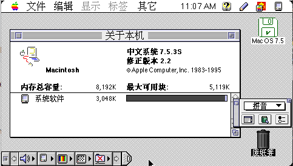

# Pocketchip-MacII-Emulator

[中文 README](./README.CN.md)

Run classic MacOS (System 7.5) on PocketCHIP.


## How to use

Clone：

```bash
git clone https://github.com/zzxzzk115/Pocketchip-MacOS-Emulator.git
```

Execute:

```bash
cd Pocketchip-MacOS-Emulator/
chmod +x minivmac
./minivmac $DISK
```

You should replace `$DISK` to your own disk file name.


## Screenshots

Run System 7.5 (Chinese version):




